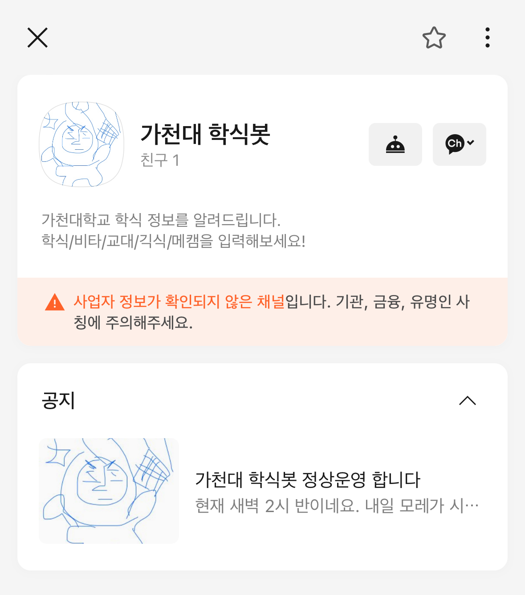
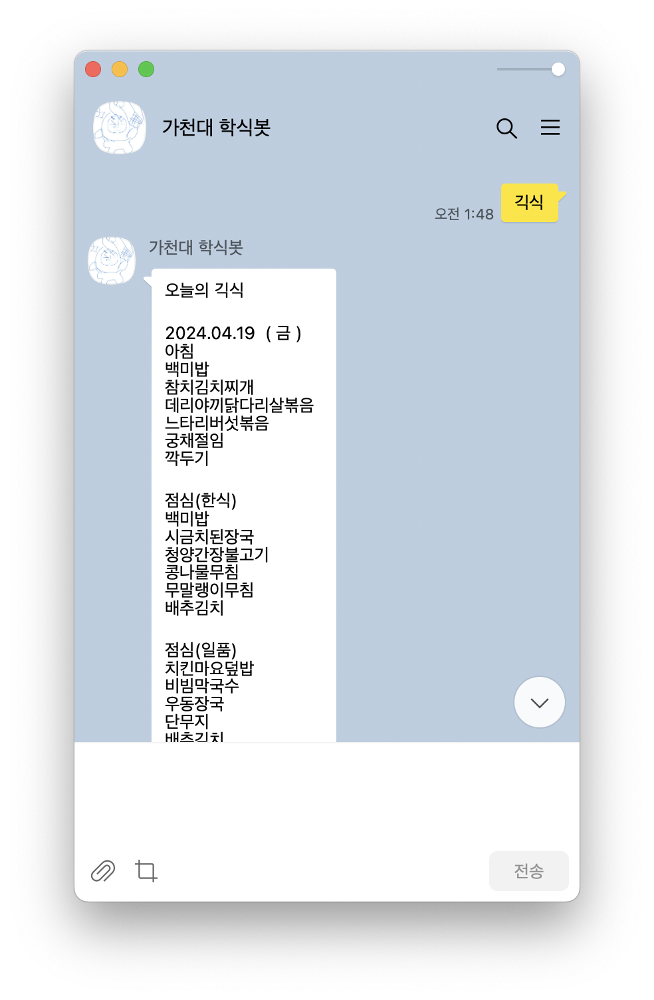
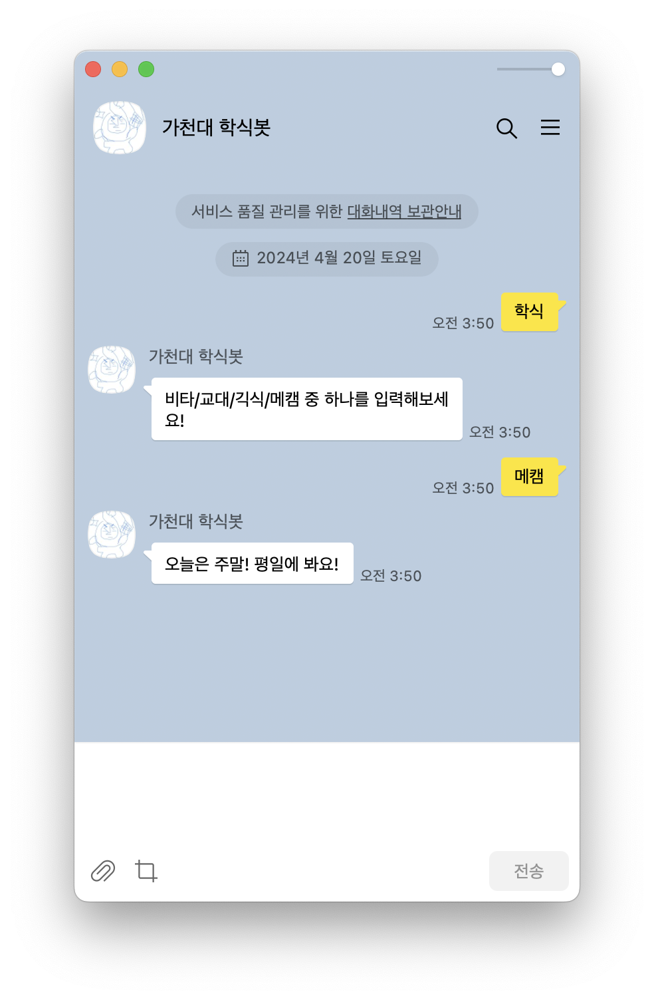

# Gachon-bot




- 채널 URL : https://pf.kakao.com/_UxfsxmG

<br>

## 어떤 프로젝트냐면...
- 아침밥도 알고 싶고 저녁밥도 알고 싶은 에공관 학생이 만든 학식봇입니다.
- 챗봇 형식으로 매일매일 학식 정보를 확인할 수 있습니다.

<br>

## 이렇게 사용하세요
|||
|---|---|
|||
|||

- `교육대학원`, `비전타워`와 같이 식당의 이름을 입력하면 오늘의 급식 정보를 보내줍니다.
- `교대`/`비타`/`에공`/`메캠`과 같은 짧은 단어는 물론, `ryeo`(교대 영어로), `ㅂㅌ`, `먀` 등과 같은 표현도 지원됩니다.
- 주말은 쉽니다!

<br>

<p>2024. 04. 24.</p>

- 시간별 식당 메뉴 안내 기능이 생겼습니다. `아침`/`점심`/`저녁` 또는 버튼을 이용해 안내를 받아보세요.

<br>

## 이렇게 개발했습니다


- `VSCode IDE`를 사용하여 파이썬 코드를 작성했어요.
- 웹 크롤링을 이용해 학생식당 정보를 불러왔습니다.


- `구름 IDE`를 이용해 플라스크로 서버를 제작했어요.


- `카카오 비즈니스 센터`에서 채널을 개설했어요.
- 카카오 채널을 개설하고 `스킬`을 이용해 챗봇을 서버와 연동시켰어요.

<br>

## 프로젝트는 이렇게 구성되어 있어요
```
├── README.md
├── LICENSE
├── .gitignore
├── application.py
└── meal.py
```

<br>

## 개발 기간은
개발 후 배포 : 2024년 4월 19일 저녁 ~ 2024년 4월 20일 새벽<br>
이후 계속해서 유지보수 중...

<br>

## 후기
서버도 처음이었고, 웹 스크래핑도 처음이었고, 플라스크라는 것도 처음이었지만, 학식을 향한 열정이 시험기간임에도 개발을 하게 만들어줬네요. 막상 완성된 것을 보니 신기합니다!
